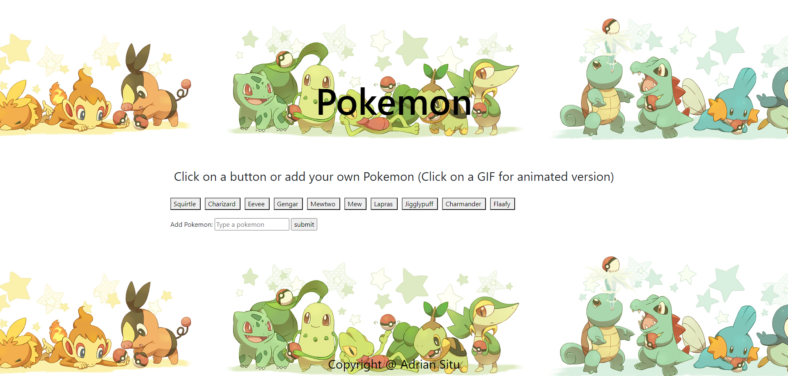
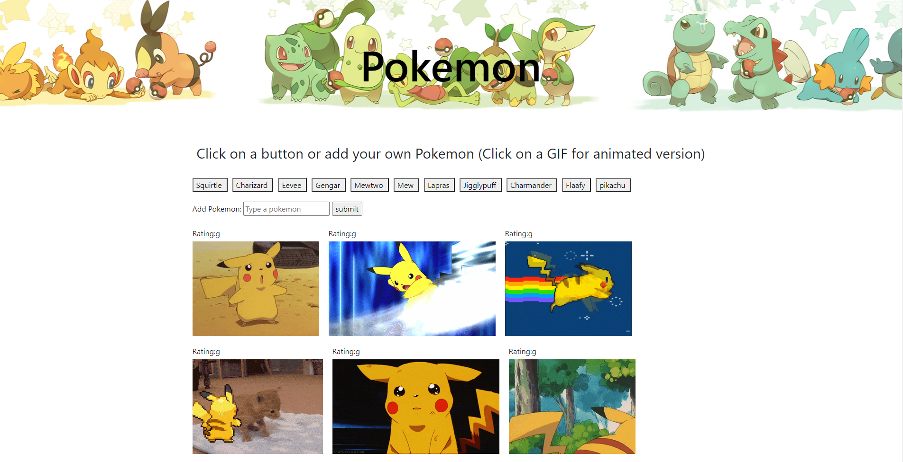

# PokeGif
PokeGif is a web-application for user to find Pokemon or other user input gifs.

## How to use
Using this application when user click a button it will show user Pokemon gifs based its what is written on the button itself.

User can create a new topic using the input form and submit button. This Button will take in-puts that's also not a Pokemon.

When user click the button, the related gif will pop-up. When user hover over the gif, it will animate in the browser.

## Link to deployed project
https://adrianctwo.github.io/PokeGif/
